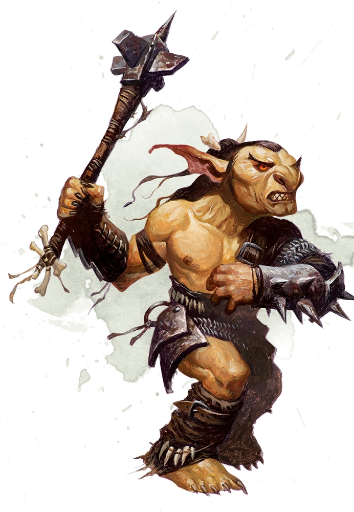

# Escort Quest

Map van de quest kan je [onderaan](#map) vinden.

Het startte allemaal in **Neverwinter**, waar jullie als groep avonturiers samen rond de tafel in de inn een drankje zaten te nuttigen.  
Plots kwam er een edele dwerg de inn binnen op zoek naar avonturiers.  
Hij stelt voor dat jullie hem helpen voor 10gp om een kar met voorraad van **Neverwinter** naar de stad van **Phandalin** te escorteren.

**Phandalin** is een mijnstadje dicht bij icespire peak.  
Dichtbij zijn de verloren mijnen van phandelver waardoor het stadje kon groeien en rijk kon worden.  
Echter zijn er nu orcs van de bergen naar de omiggende steden en dorpen gegaan.   
De orcs komen om de zoveel tijd naar beneden voor eten en voorraad.
**Gundren** en zijn krijger/bodyguard **Sildar** zijn al reeds vertrokken naar **Phandalin**.  
Nu zitten jullie op de kar samen met een bestuurder die getrokken wordt door twee paarden.

Gundren geeft jullie 10gp beloofd als jullie de kar samen met hem naar de eigenaar van *Barthens provisions* kunnen brengen.

Onderweg komen jullie een cleric tegen, **Erdem**.  
Die vertelt jullie dat het een gevraalijke tocht is naar phandalin en dat hij jullie wil helpen door een spell op jullie te casten. (hij cast "Aid" op jullie)

>"Your spell bolsters your allies with toughness and resolve. Choose up to three creatures within range. Each target's hit point maximum and current hit points increase by 5 for the duration. "

Wanner jullie om de bocht komen, liggen er 2 dode paarden op de grond voor jullie.  
De paarden zijn volledig doorzeeft met pijlen.

Als snel wordt duidelijk dat de paarden van **Gundren** en **Sildar** zijn.  

Terwijl jullie staan rond te kijken, *Goblin Ambush*!

Na de ambush volgen jullie de sporen van de *Goblins* richting de grot waar ze zich verschuilen.

Na enige tijd komen jullie in de schuilplaats van de *Goblins*.  
Na al de kronkelende gangen te onderzoeken en te vechten met alle *Goblins* (inclusief het intimideren door er een 12 keer in zijn gezicht te steken) weten jullie je een weg te banen in de grot.  
Op het einde van de grot zien jullie een stroom van water die leidt naar twee grote reservoirs met water.  
Een smalle waterval levert water voor beide reservoirs.

Helemaal achterin de grot komen jullie uit in de hideout van de leider *Klarg*, een gemene *Bugbear*.  

Na het vermoorden van de *Bugbear* leider, kunnen jullie wat proviant van de kar redden en banen jullie een weg naar de kar.  

Als jullie aankomen bij de kar echter, staan jullie oog in oog met een *witte draak*.

Na het enige tijd heldhaftig vol te houden, moeten jullie toch het onderspit delven en worden jullie bevroren in gigantische ijsblokken.  
Terwijl jullie het bewustzijn verliezen zien jullie de draak wegvliegen met de kar met voorraad.

## Map
