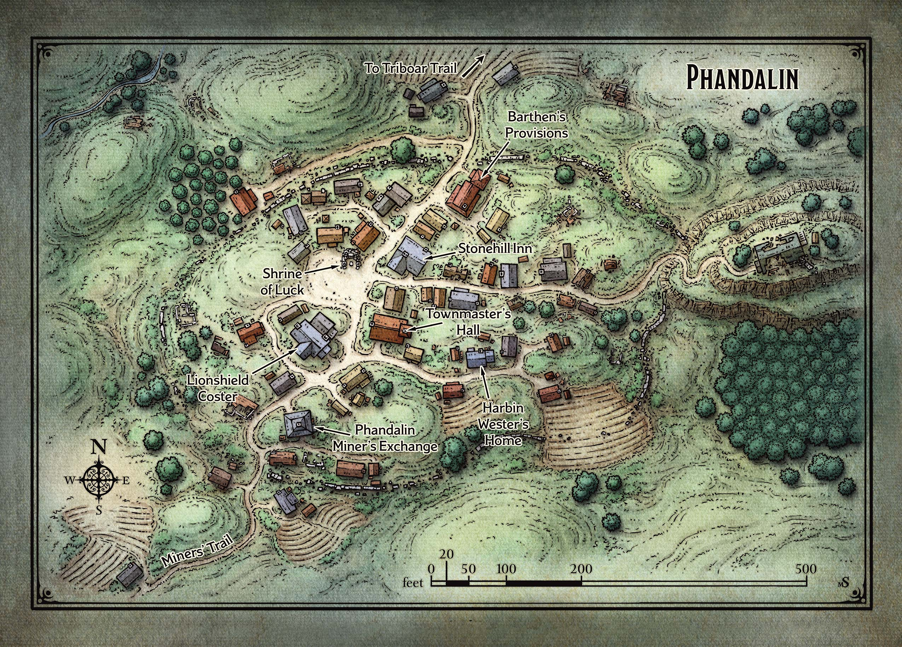

# Defrosting in Phandalin

Lees het vorige hoofstuk [hier](1-escort-quest.md)

Na enige tijd worden jullie wakker in een ziekenhuisbed in **Phandalin**.  
Jullie worden wakker gemaakt door **Velma Morningfall**, een 23-jarige verpleegster.  
Ze heeft lang, golvend, blond haar en groene ogen.  

Ze maakt jullie wakker en laat zien waar jullie spullen zijn.  

Na enige tijd wakker worden, vertelt ze dat jullie in **Phandalin** zijn.  

> Als jullie het nog zien zitten, kunnen we altijd nog avonturiers gebruiken om ons te helpen met allerlei queesten. Jullie kunnen bij het huis van onze burgemeester een bord met opdrachten vinden.  

Nadat ze deze summiere uitleg heeft gegeven, zegt ze dat jullie in orde zijn om weer te vertrekken en ze laat jullie **Phandalin** verkennen.

Hieronder kunnen jullie en overzicht vinden van wat er allemaal te zien is in **Phandalin**.  

## Phandalin

### Stonehill Inn

Dit bescheiden roadhouse met twee verdiepingen heeft op de bovenverdieping zes kamers te huur.  
Een bed voor de nacht kost *5 sp*, terwijl een maaltijd *1 sp* kost.  
De eigenaar is een korte, vriendelijke mannelijke mens genaamd **Toblen Stonehill**.  
**Toblen** is afkomstig van de stad **Triboar** in het oosten.  
Hij kwam naar **Phandalin** om te prospecteren, maar realiseerde zich al snel dat hij veel meer wist over het runnen van een herberg dan over mijnbouw.

Hier kunnen jullie allerlei roddels en gossip van de stad horen.

### Barthen’s Provisions

De schappen van deze winkel bevatten de meeste [gewone goederen en benodigdheden](https://www.dndbeyond.com/sources/basic-rules/equipment#OtherAdventuringGear) , waaronder rugzakken, beddenrollen, touw en rantsoenen. Barthen's heeft geen wapens of bepantsering, maar personages kunnen hier andere avonturenuitrusting kopen, met uitzondering van items die meer dan 25 gp kosten.

Personages die wapens of bepantsering nodig hebben, worden naar de *Lionshield Coster* geleid. Degenen die [genezingsdrankjes](https://www.dndbeyond.com/equipment/potion-of-healing) worden dringend verzocht **Adabra Gwynn** op *Umbrage Hill*.

De eigenaar, **Elmar Barthen**, is een magere en kalende menselijke man van vijftig jaar. Hij heeft een paar jonge klerken in dienst (**Ander** en **Thistle**) die helpen met het laden en lossen van wagons, en die op klanten wachten als **Barthen** er niet is.

### Lionshield Coster

> Boven de voordeur van deze bescheiden handelspost hangt een bord in de vorm van een houten schild met daarop een blauwe leeuw geschilderd.

Dit gebouw is eigendom van de **Lionshields**, een handelsbedrijf gevestigd in de stad **Yartar**, meer dan 160 kilometer naar het oosten. Het bedrijf verscheept afgewerkte goederen naar **Phandalin** en andere kleine nederzettingen in de hele regio.

De uitbaatster van de Phandalin-post is een vrouw van vijfendertig met een scherpe tong, genaamd **Linene Graywind**. **Linene** houdt een voorraad [bepantsering](https://www.dndbeyond.com/sources/basic-rules/equipment#ArmorandShields) en [wapens](https://www.dndbeyond.com/sources/basic-rules/equipment#Weapons) aan, die allemaal te koop zijn voor geïnteresseerde kopers. **Linene** verkoopt geen wapens aan iemand waarvan ze denkt dat die een bedreiging kan vormen voor de stad.

### Phandalin Miner’s Exchange

Mijnwerkers komen hier om hun waardevolle vondsten te laten wegen, meten en uitbetalen. De exchange dient ook als een onofficieel archiefkantoor, waar claims op verschillende stromen en opgravingen in het gebied worden geregistreerd. Er is genoeg rijkdom verborgen in de nabijgelegen beken en valleien om een ​​flink aantal onafhankelijke goudzoekers te onderhouden.

De exchange is een geweldige plek om mensen te ontmoeten die veel tijd doorbrengen op het platteland rond **Phandalin**. Twee broers baten de exchange uit en onderhandelen stevig over de prijs van gevonden edelstenen. Ze staan erom bekend om nogal grumpy te zijn en sarcastisch uit te hoek te komen zeker tegenover andere dwergen. (die het soms zelf zoeken in een rode leren outfit)

### Shrine of Luck

De enige tempel van **Phandalin** is een heiligdom gemaakt van stenen uit de nabijgelegen ruïnes. Het is opgedragen aan **Tymora** (godin van geluk en geluk) en wordt normaal gesproken verzorgd door een ijverige elf-acoliet genaamd zuster **Garaele**. Ze is echter de stad uit momenteel.

### Townmaster’s Hall

>De hal van de stadsmeester heeft stevige stenen muren, een schuin houten dak en een klokkentoren aan de achterkant. Op het job board naast de voordeur staan ​​een paar mededelingen.

Alle mededelingen op de job board zijn geschreven door **Harbin Wester**, de naar behoren benoemde stadsmeester van **Phandalin**. Harbin is een hoogdravende bankier van middelbare leeftijd.

Uit schrik van de draak doet **Harbin** de deur bijna nooit open.  
Hij spreekt jullie altijd aan door het kijkgat in het midden van de deur. Als jullie een job tot een goed einde brengen, schuift hij de betaling met één gouden munt tegelijk onder de deur.
