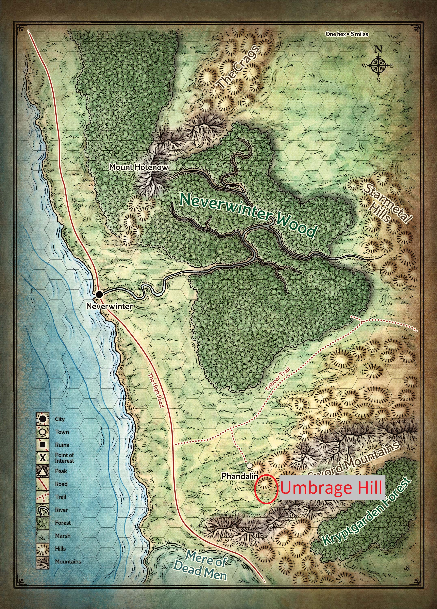
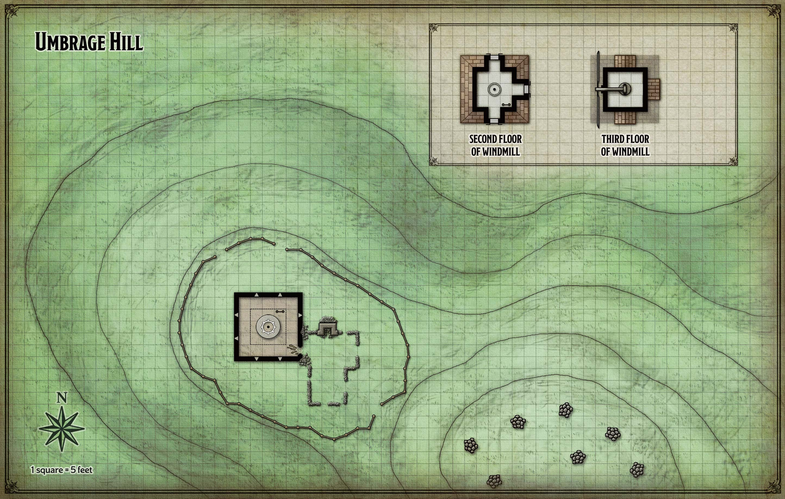
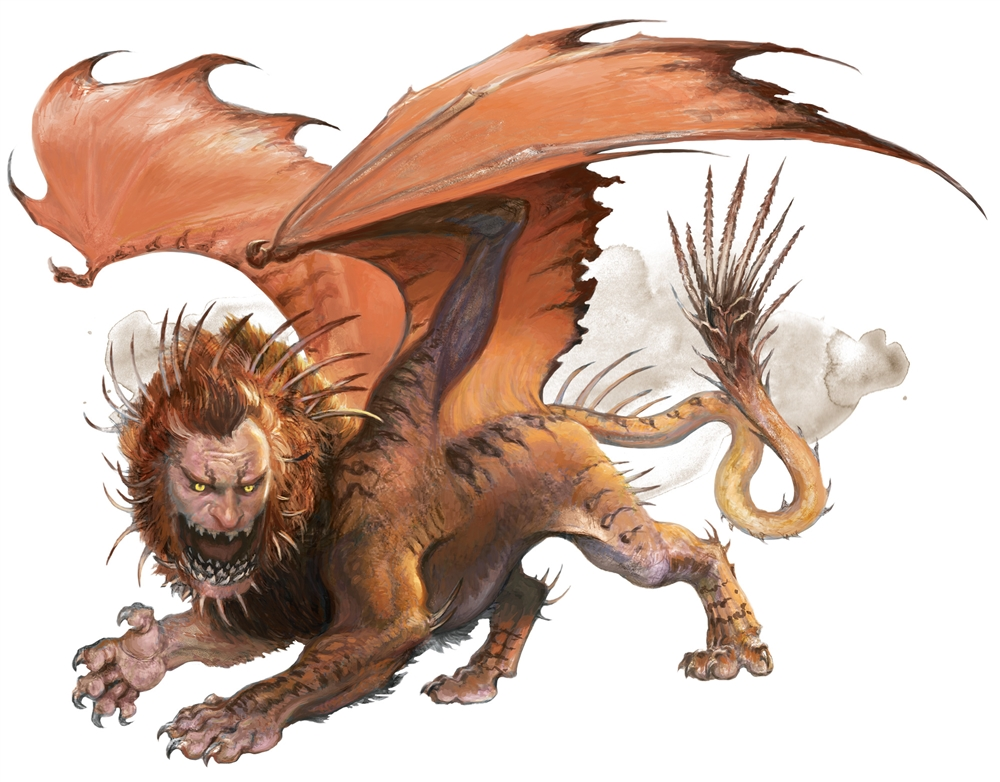

# Rescuing the lady of the mill

Lees het vorige hoofstuk [hier](2-defrosting-in-phandalin.md)

Als eerste opdracht vraang **Harbin** jullie om **Adabra** te gaan helpen in haar windmolen ten zuiden van de stad.  
Hij heeft gehoord dat ze aangevallen is en hij wil dat jullie haar gaan helpen en overtuigen om mee terug naar de stad te komen zodat ze veilig is.

## Location

## Map

## Beschrijving

>Built on the slope of Umbrage Hill is an old stone windmill surrounded by an iron fence. A large winged monster with a spiky tail is trying to knock down the windmill’s front door. A woman appears in a second-floor window, waves at you, and yells, “A little help?!”

Als jullie aankomen, vinden jullie een *Manticore* die in de windmolen wil geraken om **Adabra** aan te vallen.  

Na met de *Manticore* te praten, kunnen jullie het beest overtuigen om **Adabra** met rust te laten in ruil voor vlees.

Na enige tijd nadenken gaan er 2 personen terug naar de stad om vlees te halen, terwijl er 2 wachten bij het beest.  

Na het overhandigen van het vlees vliegt de *Manticore* weg en kunnen jullie met **Adabra**.

Ze wil niet naar de stad gaan want ze heeft te veel werkem met het maken van *Healing Potions*.  

Ze zegt wel dat als jullie ooit potions nodig hebben, jullie altijd welkom zijn om er te kopen of als jullie materialen hebben, ze te laten maken.  
