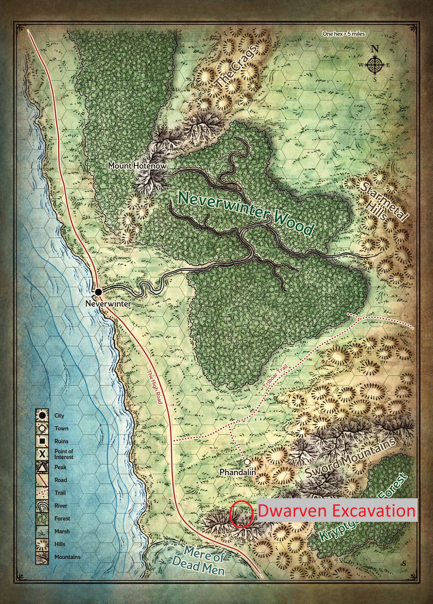
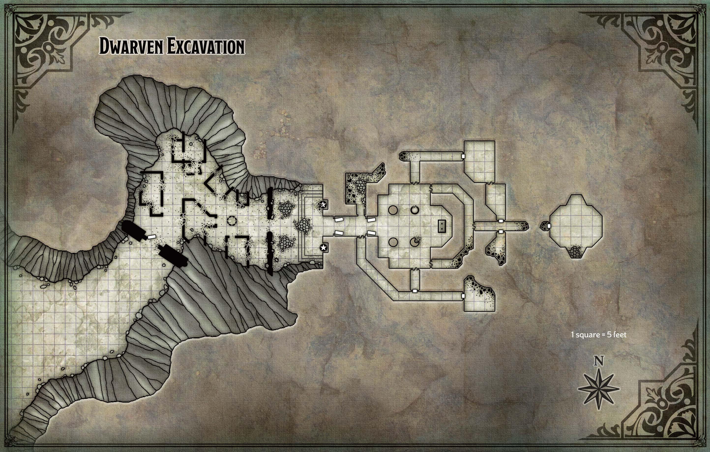
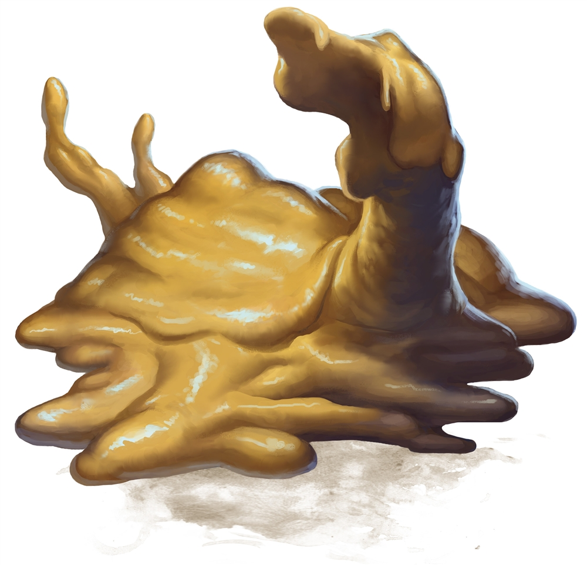
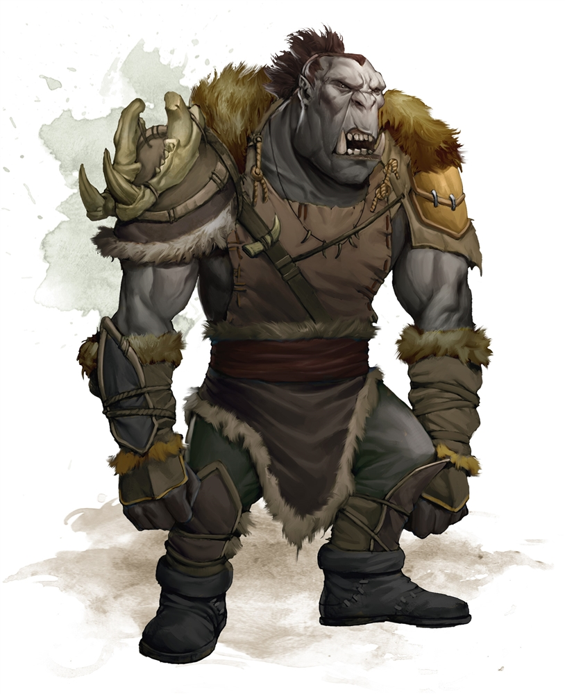

# Dwarven excavation

Lees het vorige hoofstuk [hier](3-rescuing-the-lady-of-the-mill.md)

## Quest Text

> Oude ruïnes van de dwergen liggen ten westen van hier. Twee goudzoekers zijn aan het werk in de archeologische site om goud, schatten en relikwien  te vinden.
Met de komst van de draak is het van levensbelang dat ze op de hoogte zijn van het gevaar.
Reis naar de oude ruïnes en bezorg hen de waarschuwing.  
Beloning: 50 gp

## Location

## Map

## Beschrijving

>De rotswanden van de canyon stijgen tot een hoogte van tachtig voet.  Aan het einde van de kloof is een zes meter hoge muur van zwarte steen met een gebroken poort erin uitgehouwen, met een stenen deur die gevaarlijk aan een scharnier hangt en de andere deur ontbreekt.  Achter deze open poort, in de schaduw van een grote berg in het oosten, ligt een verwoeste nederzetting.  Alles is stil.

Als jullie door de ruines lopen, zien jullie het volgende in de verte:

> Een gedeeltelijk ingestorte, drie meter hoge muur scheidt deze binnenplaats van de nederzetting ten westen ervan.  In dit gebied liggen drie puinhopen hoog opgestapeld.  Een tien meter hoge tempelgevel, uitgehouwen uit de achterwand van de kloof, heeft treden die naar een stenen platform leiden.  In deze gevel is een drie meter hoge open deuropening uitgesneden, geflankeerd door afbrokkelende, levensgrote granieten beelden van verhulde dwergen.  Kwade grijns is te zien op hun verweerde gezichten.

De tekeningen zijn van **Abbathor**, de slechte dwerggod van hebzucht.
De grote hebzuchtmeester oefent invloed uit, hoe subtiel ook, over elk dwerghart.

Tijdens zonsverduisteringen is Abbathor tevreden met bloed- en edelstenenoffers.

**Abbathor** leert dat hebzucht niet alleen wenselijk is, maar ook noodzakelijk.

**Abbathor** heeft geen vaardigheid in dingen bouwen. In plaats daarvan vertrouwt hij op zijn vermogen als dief en bedrieger om eigenaar te worden van wat hij wil.

In de verte horen jullie twee mannen ruzie maken.  
Als jullie dichterbij komen zien jullie dat het twee dwergen zijn die ruzie aan het maken zijn over dat ze nog niet alle schatten gevonden hebben.  

Ze hebben iets zien bewegen in de tempel en vragen jullie om hulp.  
Als jullie de tempel veilig kunnen maken voor hen, kunnen ze jullie wel iets geven.  

Ze stellen zich voor als **Dazlyn Grayshard** en **Norbus Ironrune**.

Eenmaal in de tempel worden jullie verrast door meerdere *Ochre Jelly*.

Binnen in de tempel vindt **Redrik** een zeer fraai, rood leren tenu.  
Hij besluit om het mee te nemen en te dragen.  

Na het verslaan van de jellies, komen jullie weer buiten maar worden jullie verrast dat de dwergen er niet meer zijn.  
Jullie worden opgewacht door een groep van *orcs*.  

Jullie weten af te rekenen met de *orcs*.  De dwergen zijn jullie enorm dankbaar en belonen jullie met een set magische stenen.

[Sending Stones - Thershann](https://www.dndbeyond.com/magic-items/5402-sending-stones)
