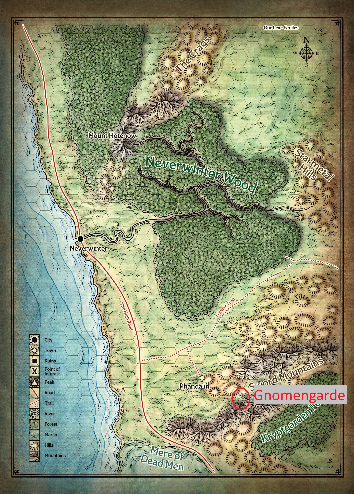
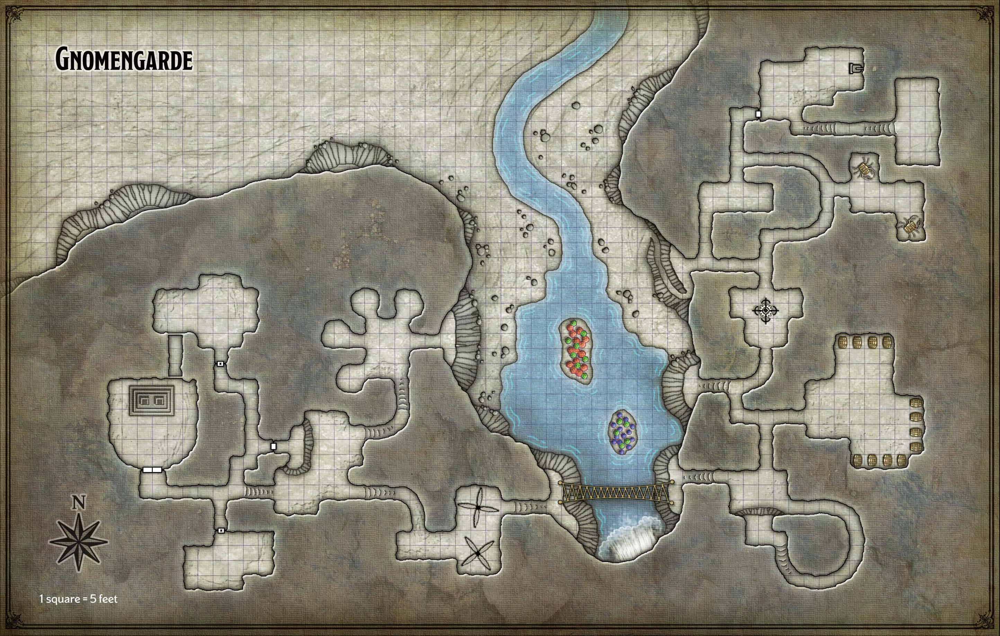
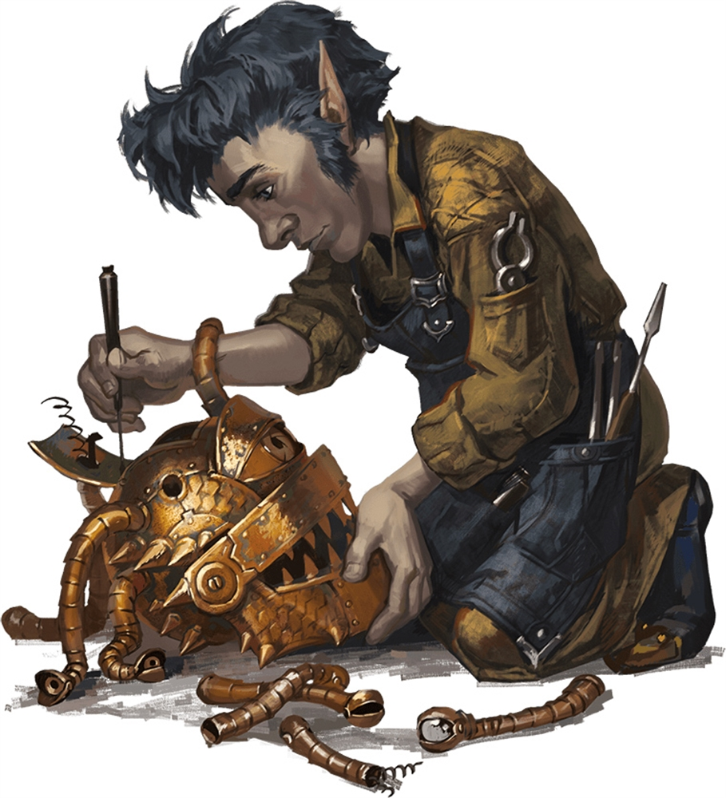
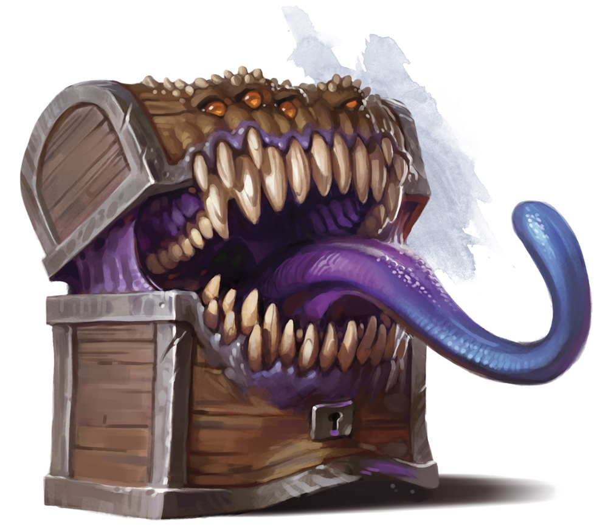

# Gnomengarde

Lees het vorige hoofstuk [hier](4-dwarven-excavation.md)

## Quest Text

> De rock gnomes van Gnomengarde zijn de beste uitvinders van de hele streek. Ga naar Gnomengarde en verzamel alle gereedschappen en uitvindingen die kunnen helpen in het verslaan van de draak.
Dan kan ik eindelijk tot rust komen. Als er bruikbare gereedschappen zijn, mogen die bij mij ingeleverd worden in ruil voor een eerlijke beloning.  
Beloning: 50 gp / bruikbaar gereedschap

## Location

## Map

## Beschrijving

>Je volgt een stroompje bergopwaarts naar de voet van de berg, waar watervalerosie een natuurlijke holte heeft uitgehouwen.  De brullende waterval creëert een mistwolk als deze in een ondiepe plas water stort, waarbinnen twee kleine eilanden oprijzen die bedekt zijn met twee meter hoge rode, groene en paarse paddenstoelen.  Verschillende grotopeningen kijken uit over het zwembad vanaf rotsachtige richels van twintig tot dertig voet erboven.  De berg blokkeert het zonlicht om deze plek te bereiken.

Bij het aankomen zien jullie in de verte een gnome, **Joybell**, de paddenstoelen harvesten met haar crab walker.

Een cab walker lijkt op een krab met een vat voor een schelp, zes gelede metalen poten en een paar naar voren gerichte tangklauwen. Een luik aan de bovenkant van het vat opent om een ​​binnencompartiment te onthullen uitgerust met een kleine, met leer beklede zitting omringd door hendels, pedalen en versnellingen. De vaten zijn niet luchtdicht.

**Joybell** verwijst jullie naar **Fibblestick** en **Dabbledob** die altijd in de werkplaats zitten.

Terwijl ze jullie mee naar de andere *gnomes* neemt, vertelt ze dat er de laatste tijd rare dingen gebeuren in **Gnomengarde**. Het lijkt wel alsof er een spook of monster is.  
Twee *gnomes* zijn verdwenen en het lijkt alsof er vanalles beweegt in **Gnomengarde**

Na enige tijd komen jullie aan in de keuken en **Joybell** stelt jullie voor aan de andere *gnomes* die er leven.  
Ze stellen voor hun paddenstoelenwijn te proberen.

Na het drinken van de wijn kunnen er allerlei dingen gebeuren, onder andere: denken dat je handen verandert zijn in tentacles, dat er allemaal insecten in de kamer zitten, dat er aliens door de muren komen, ...

Een *gnome* neemt julie mee naar de wijnkelder voor flessen te halen.  
Hierbij gaat hij nogmaals in op dat hij zweert dat er soms dingen bewegen hier!

**Joybell** geeft hen een ruwe schets van **Gnomengarde** en duid aan waar de uitvinders zitten, ze moet weer terug paddenstoelen gaan harvesten.

Eerst komen jullie een op hol geslagen kruisboog tegen die wild in het rond aan het vuren is.  
Na controle te nemen van een van de crab walkers, kunnen jullie die uitschakelen.

Verderop komen jullie 2 guards tegen die jullie tegenhouden met een "Wacht, wie gaat daar?" en zeggen dat ze orders hebben gekregen om shapeshifters meteen aan te vallen.

Jullie kunnen ze overtuigen om niet te schieten en mogen verder gaan.  

Over de brug komen jullie de spinning blades tegen met een hendel tegen de muur aan de overkant
Jullie zijn de blades te slim af en kunnen ze uitschakelen om de brug over te steken.

Aan de overkant komen jullie in een grote workshop terecht.
Hier treffen jullie de inventors aan, die discusieren over wat ze zullen bouwen om hun koning te redden van zijn krankzinnigheid.  
Het debat gaat tussen een *Sanity Ray* en een *Straitjacket*.  
Als jullie binnenkomen, leggen ze de hele situatie uit met de koningen en vragen om hulp dan krijgen jullie nog meer magische items om tegen de draak te vechten.

Als voorschot hebben jullie een [Pole of Collapsing - Thershann](https://www.dndbeyond.com/magic-items/27112-pole-of-collapsing)

Ze vertellen jullie ook dat de koningen de beste magic items hebben.

Als ze akkoord gaan dan verwijzen de uitvinders door naar de koningen in de aangrenzende kamers. Terwijl zij nog verder gaan discussieren.

Wanneer jullie op de slaapkamer van kloppen, dan antwoord Koning **Korboz**.
Hij zegt dat hij de deur niet open durft te doen. Hij weet dat er een shape shifter is.
Het heeft me aangevallen. Toen leek het op een groot tapijt in de troonzaal. Maar het is er vast al lang vandoor en ziet er anders uit. Misschien was het **Gnerkli** wel, daarom heb ik hem vastgebonden omdat ik denk dat hij het is. Ik laat jullie er pas in als jullie me bewijs brengen dat de shape shifter dood is!
Vraag de bewoners om jullie te helpen om hem sneller te ontmaskeren!

Na enige zoektocht weten jullie de *mimic* te vinden.  

Na een gevecht kunnen jullie het overmeesteren en krijgen jullie van de koningen volgende items:

- [Hat of Wizardry - Corbett](https://www.dndbeyond.com/magic-items/27050-hat-of-wizardry)
- [Wand of Pyrotechnics - Redrik](https://www.dndbeyond.com/magic-items/27147-wand-of-pyrotechnics)
- [Clockwork Amulet - Redrik](https://www.dndbeyond.com/magic-items/27042-clockwork-amulet)
