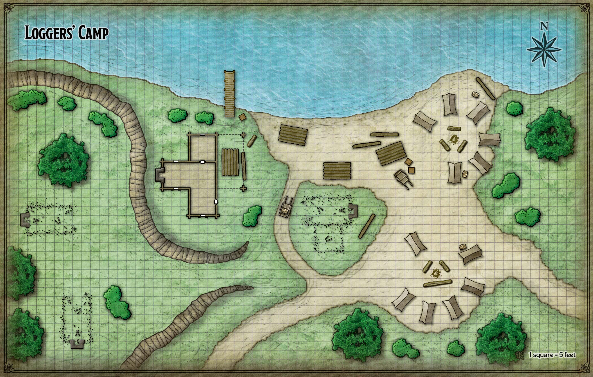

---
layout: default
title: "5 Gnomengarde"
nav_order: 5
parent: "Adventure Recaps"
has_children: false
---

# Gnomengarde

Lees het vorige hoofstuk [hier](5-gnomengarde.md)

## Quest Text

>

## Location

## Map

## Beschrijving

Jullie gaan naar **Barthen** om de kar met voorraad op te halen.  
Hij geeft jullie een kar met een os mee. De os noemt **Vincent** zegt hij en geeft jullie simpele instructies om naar het kamp te gaan.

Onderweg naar het logging camp, kom jullie een everzwijn tegen.  
Het everzwijn lijkt nogal verdacht lang naar jullie te staren.
Het is een hele zoektocht naar het kamp, maar jullie weten toch ernaartoe te navigeren.   
Eenmaal aangekomen bij het kamp, zagen jullie het volgende.

>Het houthakkerskamp strekt zich uit langs de zuidoever van de rivier, waar een tiental tenten op een zandstrand staan ​​opgesteld. Bij een dok staat een hut met boomstammen gestapeld onder een luifel. Oudere hutten in de buurt zijn afgebroken om alleen stenen schoorstenen en funderingen over te laten. Er hangt een grimmige stilte over het kamp en je ziet niemand om je heen.

Een akelig gevoel overviel jullie terwijl jullie op zoek gingen naar **Tibor Wester**, de baas van het kamp.

Er hangt een grillige sfeer in het kamp alsof er iets bovennatuurlijks aan de hand is.  
