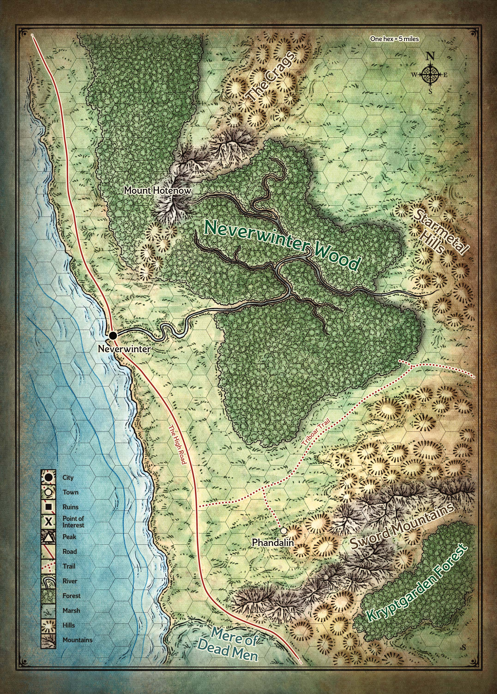
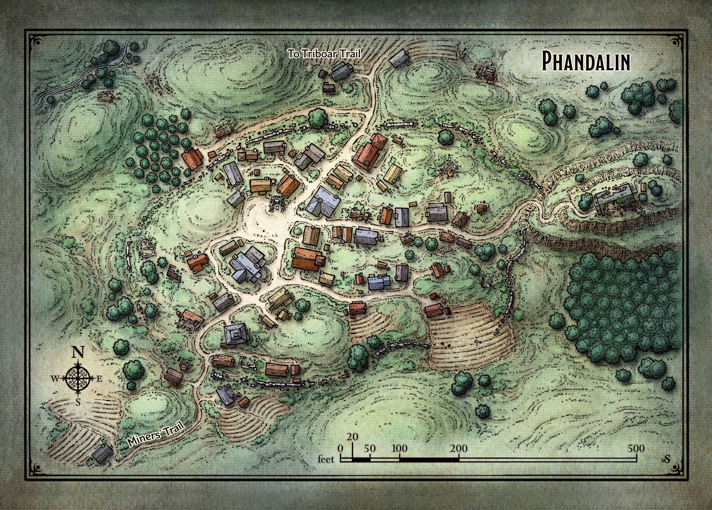

# Sword Coast

Het avontuur speelt zich af in de *Forgotten Realms* setting.  
Binnen die regio ligt een groot gebied genaamd de *Sword Coast*.  
Tijdens de session schuimt de party de hele regio af.

> Dit is een plaats van avontuur, waar gedurfde zielen zich graven in oude bolwerken en de ruïnes van lang verloren koninkrijken verkennen.  
Te midden van een wetteloze wildernis van grillige, met sneeuw bedekte toppen, alpenbossen, bittere winden en rondzwervende monsters, herbergt de kust zulke grote bastions van beschaving als de stad Neverwinter, in de schaduw van de rokende vulkaan die bekend staat als Mount Hotenow.

Specifieke regios worden toegelicht in de adventure recaps.  
Hier geef ik aan waar de regio zich bevind alsook detail maps voor de regio zelf.

# Phandalin

Phandalin is de thuisbasis van de party.  
Gedetailleerde omschrijving van Phandalin is te vinden in de adventure recap "[2 Defrosting in Phandalin](adventure-recaps/2-defrosting-in-phandalin.md)"

> Genesteld in de rotsachtige uitlopers van de met sneeuw bedekte Sword Mountains ligt het mijnstadje Phandalin, dat bestaat uit veertig of vijftig eenvoudige blokhutten.  
Afbrokkelende stenen ruïnes omringen de nieuwere huizen en winkels en laten zien hoe dit in de afgelopen eeuwen een veel grotere stad moet zijn geweest.

> De inwoners van Phandalin zijn rustige, hardwerkende mensen die uit verre steden kwamen om een ​​leven op te bouwen in de ruige wildernis.  
Het zijn boeren, steenhouwers, smeden, handelaren, goudzoekers en kinderen.  
De stad heeft geen muren en geen garnizoen, maar de meeste volwassenen houden wapens binnen handbereik voor het geval dat er wapens nodig zijn.

> Bezoekers zijn hier welkom, vooral als ze munten te besteden hebben of nieuws willen delen.  
De Stonehill Inn in het centrum van de stad biedt bescheiden accommodatie en maaltijden.  
Een paar deuren verder van de herberg, buiten de hal van de burgemeester, is een job bord voor avonturiers op zoek naar roem en glorie, maar misschien ook gewoon wat goud.

