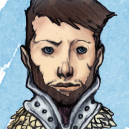

# Corbett Holysun

[DnDbeyond.com link](https://www.dndbeyond.com/characters/21498893)

{:width="300px"}

## Background

**Sage** / **Researcher**

When you attempt to learn or recall a piece of lore, if you do not know that information, you often know where and from whom you can obtain it.  
Usually, this information comes from a library, scriptorium, university, or a sage or other learned person or creature.

## Characteristics

- Alignment:
- Gender:
- Eyes:
- Size: Medium
- Height:
- Weight:  
- Faith:
- Hair:
- Skin:
- Age:
