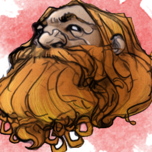

# Redrik Goldfinder

[DnDbeyond.com link](https://www.dndbeyond.com/characters/21456424)

{:width="300px"}

## Background

**Gambler** / **Never Tell Me the Odds**

Odds and probability are your bread and butter.  
During downtime activities that involve games of chance or figuring odds on the best plan, you can get a solid sense of which choice is likely the best one and which opportunities seem too good to be true.

## Characteristics

- Alignment: Lawful Good
- Gender:
- Eyes:
- Size: Medium
- Height:
- Weight:  
- Faith:
- Hair:
- Skin:
- Age:

## Personality Traits

Nothing is certain. Planning is a coward’s act.

## Ideals

Fate. Whatever happens is fated, regardless of any planning or striving. (Lawful)

## Bonds

I’m loyal to the friend or family member who taught me how to gamble.

## Flaws

You can loan me a little, right? I’ve got a sure thing. I’ll double your money, guaranteed.
