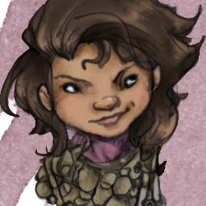

# Trym Tealeaf

[DnDbeyond.com link](https://www.dndbeyond.com/characters/21199852)

{:width="300px"}

## Background

**Sage** / **Researcher**

When you attempt to learn or recall a piece of lore, if you do not know that information, you often know where and from whom you can obtain it.  
Usually, this information comes from a library, scriptorium, university, or a sage or other learned person or creature.

## Characteristics

- Alignment: Lawful Good
- Gender: Female
- Eyes: Brown
- Size: Small
- Height: 95 cm
- Weight: 35 lb
- Faith:
- Hair: Brown
- Skin: Tan
- Age: 24

## Personality Traits

I’m willing to listen to every side of an argument before I make my own judgment.  
There’s nothing I like more than a good mystery.

## Ideals

Self-Improvement. The goal of a life of study is the betterment of oneself. (Any)

## Bonds

I’ve been searching my whole life for the answer to a certain question.

## Flaws

I am easily distracted by the promise of information.
